# DSP Assignment 1：RC Low-Pass Filter
### 班級:通訊碩一 學號:711581103 姓名:吳祖慷  
 
 ---

## Part A：相子暖身題
###  A1:用積化和差／和差化積計算 Z(t) = X(t) + Y(t)
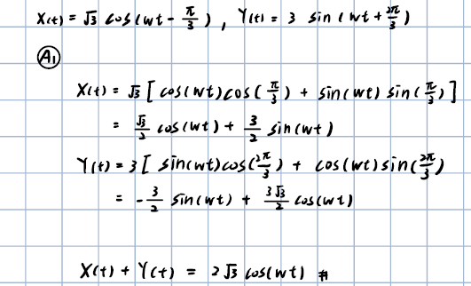
---
###  A2:用相子（phasor）計算 Z(t) = X(t) + Y(t)，與 A1 比對
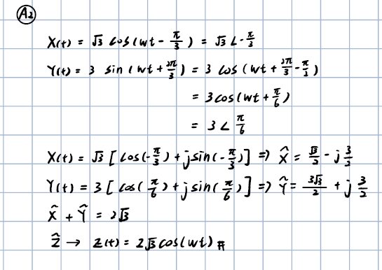
---
###  A3:繪製圖形


---

## Part B：RC 低通濾波器
### 背景
在此 RC 電路中
$$
R=1000\ \Omega,\qquad
C=\frac{1}{2\pi}\cdot\frac{1}{400}\cdot\frac{1}{1000}\ \mathrm{F}
$$

因此時間常數與截止頻率為

$$
RC=\frac{1}{2\pi\cdot400}\ \mathrm{s},\qquad
f_c=\frac{1}{2\pi RC}=400\ \mathrm{Hz}.
$$

---
### B1-手寫


---
### B1-LaTex

電路微分方程為

$$
RC\frac{dy(t)}{dt}+y(t)=x(t).
$$

輸入為 $x(t)=e^{j\Omega t}$，並假設穩態輸出為 $y(t)=H(\Omega)e^{j\Omega t}$。代入微分方程可得

$$
j\Omega RC H(\Omega)e^{j\Omega t}+H(\Omega)e^{j\Omega t}=e^{j\Omega t},
$$

因此

$$
H(\Omega)=\frac{1}{1+j\Omega RC},\qquad
y(t)=\frac{e^{j\Omega t}}{1+j\Omega RC}.
$$

其振幅與相位分別為

$$
|H(\Omega)|=\frac{1}{\sqrt{1+(\Omega RC)^2}},\qquad
\angle H(\Omega)=-\tan^{-1}(\Omega RC).
$$

---
### B2-手寫


---
### B2-LaTex

已知輸入訊號為

$$
x(t)=e^{j\Omega t}u(t)
$$

RC 低通濾波器的轉移函數為

$$
H(s)
=
\frac{1}{1+RCs}
=
\frac{1}{1+\tau s}.
$$

輸入訊號的 Laplace Transform 為

$$
\mathcal{L}
\left\{
e^{j\Omega t}u(t)
\right\}
=
\frac{1}{s-j\Omega}.
$$

因此輸出訊號在 $s$ domain 中可以表示為

$$
Y(s)
=
H(s)X(s).
$$

代入 $H(s)$ 與 $X(s)$：

$$
Y(s)
=
\frac{1}{1+\tau s}
\cdot
\frac{1}{s-j\Omega}.
$$

由於

$$
1+\tau s
=
\tau
\left(
s+\frac{1}{\tau}
\right),
$$

因此可以將 $Y(s)$ 改寫為

$$
Y(s)
=
\frac{1}{\tau}
\frac{1}
{
\left(s+\frac{1}{\tau}\right)
(s-j\Omega)
}.
$$

接著使用部分分式展開（Partial Fraction Expansion）：

$$
Y(s)
=
\frac{1}{\tau}
\left[
\frac{A}{s-j\Omega}
+
\frac{B}{s+\frac{1}{\tau}}
\right].
$$

分別求得係數 $A$ 與 $B$：

$$
A
=
\frac{\tau}
{1+j\Omega\tau}
$$

以及

$$
B
=
-\frac{\tau}
{1+j\Omega\tau}.
$$

將 $A$、$B$ 代回 $Y(s)$：

$$
Y(s)
=
\frac{1}{\tau}
\left[
\frac{\tau}{1+j\Omega\tau}
\frac{1}{s-j\Omega}
-
\frac{\tau}{1+j\Omega\tau}
\frac{1}{s+\frac{1}{\tau}}
\right].
$$

整理後可得

$$
Y(s)
=
\frac{1}{1+j\Omega\tau}
\left[
\frac{1}{s-j\Omega}
-
\frac{1}{s+\frac{1}{\tau}}
\right].
$$

接著進行 Inverse Laplace Transform：

$$
\mathcal{L}^{-1}
\{Y(s)\}
=
\frac{1}{1+j\Omega\tau}
\left[
e^{j\Omega t}
-
e^{-t/\tau}
\right]u(t).
$$

由於

$$
\tau=RC,
$$

因此最後輸出訊號為

$$
\boxed{
y(t)
=
\frac{1}{1+j\Omega RC}
\left[
e^{j\Omega t}
-
e^{-t/(RC)}
\right]u(t)
}
$$

由上式可以將輸出分成穩態響應與暫態響應：

$$
y(t)
=
\left[
\frac{1}{1+j\Omega RC}e^{j\Omega t}
-
\frac{1}{1+j\Omega RC}e^{-t/(RC)}
\right]u(t).
$$

#### 穩態響應（Steady-State Response）

第一項為穩態響應：

$$
\boxed{
y_{ss}(t)
=
\frac{1}{1+j\Omega RC}
e^{j\Omega t}u(t)
}
$$

此項與輸入訊號具有相同的頻率 $\Omega$，但經過 RC 低通濾波器後，其振幅與相位會受到頻率響應

$$
H(j\Omega)
=
\frac{1}{1+j\Omega RC}
$$

的影響。

#### 暫態響應（Transient Response）

第二項為暫態響應：

$$
\boxed{
y_{tr}(t)
=
-\frac{1}{1+j\Omega RC}
e^{-t/(RC)}u(t)
}
$$

其中

$$
e^{-t/(RC)}
$$

會隨著時間增加逐漸衰減。

當

$$
t\rightarrow\infty
$$

時，

$$
e^{-t/(RC)}
\rightarrow0,
$$

因此

$$
y_{tr}(t)\rightarrow0.
$$

經過足夠長的時間後，系統只剩下穩態響應：

$$
\boxed{
y(t)
\rightarrow
\frac{1}{1+j\Omega RC}
e^{j\Omega t}
}
$$
與 B1 所求得的穩態響應一樣。

---
### B3-手寫
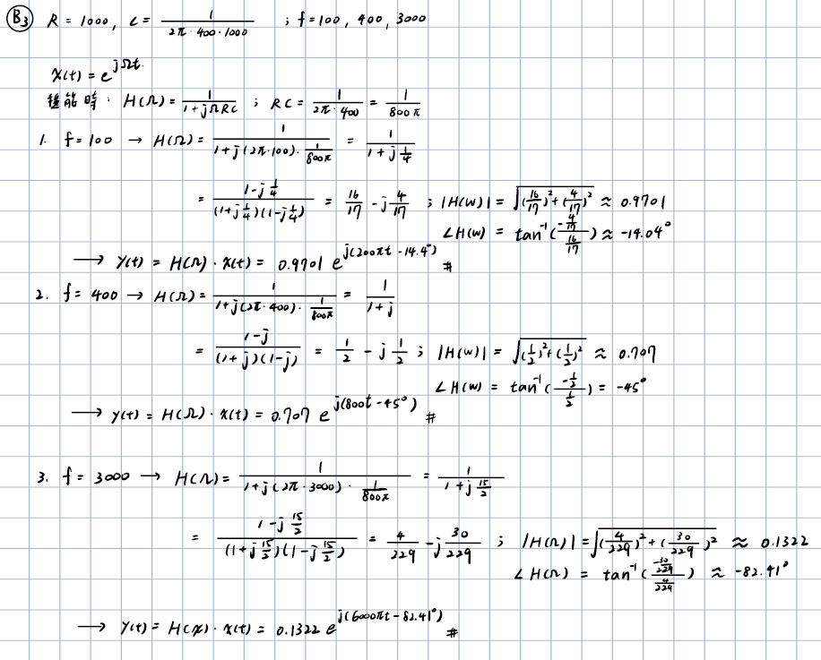
---

### B3-LaTex

輸入訊號為

$$
x(t)=e^{j\Omega t},
$$

其中

$$
\Omega=2\pi f.
$$

由 B1 可知 RC 低通濾波器的頻率響應為

$$
H(\Omega)
=
\frac{1}{1+j\Omega RC}.
$$
---

#### Case 1：$f=100$ Hz

當

$$
f=100\ {\rm Hz},\Omega=2\pi(100)=200\pi.
$$


$$
RC=\frac{1}{800\pi}
$$

可得

$$
H(\Omega)=\frac{1}
{
1+j(2\pi\cdot100)
\left(
\frac{1}{800\pi}
\right)
}
=
\frac{1}{1+j\frac{1}{4}}
=
\frac{
1-j\frac{1}{4}
}{
\left(1+j\frac{1}{4}\right)
\left(1-j\frac{1}{4}\right)
}=
\frac{16}{17}
-j\frac{4}{17}

$$
振幅為
$$
|H(\Omega)|=
\sqrt{
\left(\frac{16}{17}\right)^2
+
\left(-\frac{4}{17}\right)^2
}
\approx0.9701


$$
相位為
$$

\angle H(\Omega)
=
\tan^{-1}
\left(
\frac{-4/17}{16/17}
\right)
\approx-14.04^\circ

$$
輸出訊號為
$$

y(t)=H(\Omega)x(t)=0.9701e^{j(200\pi t-14.04^\circ)}

$$

---


#### Case 2：$f=400$ Hz

當

$$
f=400\ {\rm Hz},\quad
\Omega=2\pi(400)=800\pi.
$$

由

$$
RC=\frac{1}{800\pi}
$$

可得

$$
\begin{aligned}
H(\Omega)
&=
\frac{1}
{
1+j(2\pi\cdot400)
\left(
\frac{1}{800\pi}
\right)
}
\\
&=
\frac{1}{1+j}
\\
&=
\frac{1-j}
{(1+j)(1-j)}
\\
&=
\frac{1}{2}
-j\frac{1}{2}.
\end{aligned}
$$

振幅為

$$
\begin{aligned}
|H(\Omega)|
&=
\sqrt{
\left(\frac{1}{2}\right)^2
+
\left(-\frac{1}{2}\right)^2
}
\\
&=
\frac{1}{\sqrt{2}}
\\
&\approx0.7071.
\end{aligned}
$$

相位為

$$
\begin{aligned}
\angle H(\Omega)
&=
\tan^{-1}
\left(
\frac{-1/2}{1/2}
\right)
\\
&=
-45^\circ.
\end{aligned}
$$

輸出訊號為

$$
\boxed{
y(t)
=
H(\Omega)x(t)
=
0.7071e^{j(800\pi t-45^\circ)}
}
$$

---

#### Case 3：$f=3000$ Hz

當

$$
f=3000\ {\rm Hz},\quad
\Omega=2\pi(3000)=6000\pi.
$$

由

$$
RC=\frac{1}{800\pi}
$$

可得

$$
\begin{aligned}
H(\Omega)
&=
\frac{1}
{
1+j(2\pi\cdot3000)
\left(
\frac{1}{800\pi}
\right)
}
\\
&=
\frac{1}
{1+j\frac{15}{2}}
\\
&=
\frac{
1-j\frac{15}{2}
}{
\left(1+j\frac{15}{2}\right)
\left(1-j\frac{15}{2}\right)
}
\\
&=
\frac{4}{229}
-j\frac{30}{229}.
\end{aligned}
$$

振幅為

$$
\begin{aligned}
|H(\Omega)|
&=
\sqrt{
\left(\frac{4}{229}\right)^2
+
\left(-\frac{30}{229}\right)^2
}
\\
&\approx0.1322.
\end{aligned}
$$

相位為

$$
\begin{aligned}
\angle H(\Omega)
&=
\tan^{-1}
\left(
\frac{-30/229}{4/229}
\right)
\\
&\approx-82.41^\circ.
\end{aligned}
$$

輸出訊號為

$$
\boxed{
y(t)
=
H(\Omega)x(t)
=
0.1322e^{j(6000\pi t-82.41^\circ)}
}
$$

---
### B4：手寫
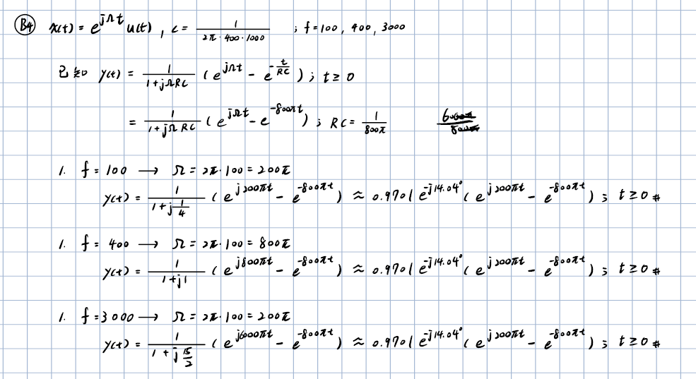

---
### B4：LaTex

輸入訊號為

$$
x(t)=e^{j\Omega t}u(t)
$$

且

$$
R=1000\ \Omega,
\qquad
C=\frac{1}{2\pi\cdot400\cdot1000}.
$$

由 B2 可知輸出訊號為

$$
y(t)
=
\frac{1}{1+j\Omega RC}
\left(
e^{j\Omega t}
-
e^{-t/(RC)}
\right)u(t).
$$

由

$$
RC=\frac{1}{800\pi}
$$

可得

$$
e^{-t/(RC)}
=
e^{-800\pi t}.
$$

因此

$$
y(t)
=
\frac{1}{1+j\Omega RC}
\left(
e^{j\Omega t}
-
e^{-800\pi t}
\right)u(t).
$$

---

#### Case 1：$f=100$ Hz

當

$$
f=100\ {\rm Hz},
\qquad
\Omega=2\pi(100)=200\pi.
$$

由

$$
RC=\frac{1}{800\pi}
$$

可得

$$
\begin{aligned}
H(\Omega)
&=
\frac{1}
{
1+j(200\pi)
\left(
\frac{1}{800\pi}
\right)
}
\\
&=
\frac{1}{1+j\frac14}
\\
&=
0.9701e^{-j14.04^\circ}.
\end{aligned}
$$

因此輸出訊號為

$$
\boxed{
y(t)
=
0.9701e^{-j14.04^\circ}
\left(
e^{j200\pi t}
-
e^{-800\pi t}
\right)u(t)
}
$$

---

#### Case 2：$f=400$ Hz

當

$$
f=400\ {\rm Hz},
\qquad
\Omega=2\pi(400)=800\pi.
$$

由

$$
RC=\frac{1}{800\pi}
$$

可得

$$
\begin{aligned}
H(\Omega)
&=
\frac{1}
{
1+j(800\pi)
\left(
\frac{1}{800\pi}
\right)
}
\\
&=
\frac{1}{1+j}
\\
&=
0.7071e^{-j45^\circ}.
\end{aligned}
$$

因此輸出訊號為

$$
\boxed{
y(t)
=
0.7071e^{-j45^\circ}
\left(
e^{j800\pi t}
-
e^{-800\pi t}
\right)u(t)
}
$$

---

#### Case 3：$f=3000$ Hz

當

$$
f=3000\ {\rm Hz},
\qquad
\Omega=2\pi(3000)=6000\pi.
$$

由

$$
RC=\frac{1}{800\pi}
$$

可得

$$
\begin{aligned}
H(\Omega)
&=
\frac{1}
{
1+j(6000\pi)
\left(
\frac{1}{800\pi}
\right)
}
\\
&=
\frac{1}{1+j\frac{15}{2}}
\\
&=
0.1322e^{-j82.41^\circ}.
\end{aligned}
$$

因此輸出訊號為

$$
\boxed{
y(t)
=
0.1322e^{-j82.41^\circ}
\left(
e^{j6000\pi t}
-
e^{-800\pi t}
\right)u(t)
}
$$

---


三種輸入頻率的暫態部分皆包含

$$
e^{-800\pi t},
$$

因為暫態衰減速度由 RC 電路本身的時間常數 $RC$ 決定，而與輸入頻率無關。

當

$$
t\rightarrow\infty
$$

時，

$$
e^{-800\pi t}\rightarrow0,
$$
因此暫態響應逐漸消失，最後只剩下 B3 所求得的穩態響應。

---

### B5：手寫

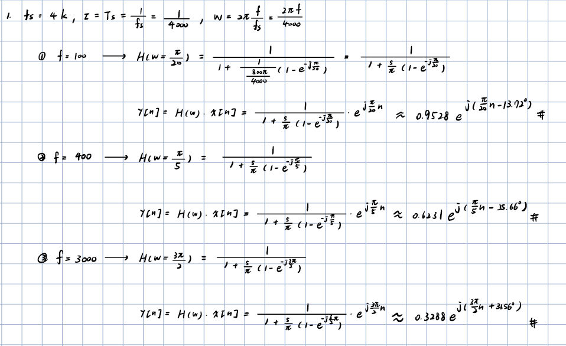


---
### B5：LaTex
已知

$$
y[n]=\frac{RC}{RC+\tau}y[n-1]+\frac{\tau}{RC+\tau}x[n],\qquad \tau=T_s=\frac{1}{f_s}
$$

輸入訊號為

$$
x[n]=e^{j\omega n}.
$$

令

$$
a=\frac{RC}{RC+\tau},\qquad b=\frac{\tau}{RC+\tau},
$$

則

$$
y[n]=ay[n-1]+bx[n].
$$

兩邊進行 Z Transform：

$$
Y(z)=az^{-1}Y(z)+bX(z)
$$

因此

$$
(1-az^{-1})Y(z)=bX(z)
$$

所以系統轉移函數為

$$
H(z)=\frac{Y(z)}{X(z)}=\frac{b}{1-az^{-1}}=\frac{\frac{\tau}{RC+\tau}}{1-\frac{RC}{RC+\tau}z^{-1}}=\frac{\tau}{\tau+RC(1-z^{-1})}
$$

令

$$
z=e^{j\omega},
$$

則

$$
H(\omega)=\frac{\tau}{\tau+RC(1-e^{-j\omega})}
,RC=\frac{1}{800\pi}
$$

---

#### 1. $f_s=4000$ Hz

當

$$
f_s=4000\ {\rm Hz},\qquad \tau=\frac{1}{4000},\qquad \omega=\frac{2\pi f}{4000},
$$

可得

$$
\frac{1}{800\pi\tau}=\frac{5}{\pi},
$$

因此

$$
\boxed{
H(\omega)=\frac{1}{1+\frac{5}{\pi}(1-e^{-j\omega})}
}
$$

#### Case 1：$f=100$ Hz

$$
\omega=\frac{2\pi(100)}{4000}=\frac{\pi}{20}
$$

$$
H\left(\frac{\pi}{20}\right)=\frac{1}{1+\frac{5}{\pi}(1-e^{-j\pi/20})}
$$

$$
\boxed{
y[n]\approx0.9528e^{j\left(\frac{\pi}{20}n-13.72^\circ\right)}
}
$$

#### Case 2：$f=400$ Hz

$$
\omega=\frac{2\pi(400)}{4000}=\frac{\pi}{5}
$$

$$
H\left(\frac{\pi}{5}\right)=\frac{1}{1+\frac{5}{\pi}(1-e^{-j\pi/5})}
$$

$$
\boxed{
y[n]\approx0.6231e^{j\left(\frac{\pi}{5}n-35.66^\circ\right)}
}
$$

#### Case 3：$f=3000$ Hz

$$
\omega=\frac{2\pi(3000)}{4000}=\frac{3\pi}{2}
$$

$$
H\left(\frac{3\pi}{2}\right)=\frac{1}{1+\frac{5}{\pi}(1-e^{-j3\pi/2})}
$$

$$
\boxed{
y[n]\approx0.3288e^{j\left(\frac{3\pi}{2}n+31.56^\circ\right)}
}
$$

此時 Nyquist frequency 為

$$
f_N=\frac{4000}{2}=2000\ {\rm Hz},
$$

而

$$
3000>2000,
$$

因此會發生 aliasing。

---

#### 2. $f_s=8000$ Hz

當

$$
f_s=8000\ {\rm Hz},\qquad \tau=\frac{1}{8000},\qquad \omega=\frac{2\pi f}{8000},
$$

可得

$$
\frac{1}{800\pi\tau}=\frac{10}{\pi},
$$

因此

$$
\boxed{
H(\omega)=\frac{1}{1+\frac{10}{\pi}(1-e^{-j\omega})}
}
$$

#### Case 1：$f=100$ Hz

$$
\omega=\frac{2\pi(100)}{8000}=\frac{\pi}{40}
$$

$$
\boxed{
y[n]\approx0.9613e^{j\left(\frac{\pi}{40}n-13.89^\circ\right)}
}
$$

#### Case 2：$f=400$ Hz

$$
\omega=\frac{2\pi(400)}{8000}=\frac{\pi}{10}
$$

$$
\boxed{
y[n]\approx0.6589e^{j\left(\frac{\pi}{10}n-40.40^\circ\right)}
}
$$

#### Case 3：$f=3000$ Hz

$$
\omega=\frac{2\pi(3000)}{8000}=\frac{3\pi}{4}
$$

$$
\boxed{
y[n]\approx0.1467e^{j\left(\frac{3\pi}{4}n-19.28^\circ\right)}
}
$$

---

#### 3. $f_s=16000$ Hz

當

$$
f_s=16000\ {\rm Hz},\qquad \tau=\frac{1}{16000},\qquad \omega=\frac{2\pi f}{16000},
$$

可得

$$
\frac{1}{800\pi\tau}=\frac{20}{\pi},
$$

因此

$$
\boxed{
H(\omega)=\frac{1}{1+\frac{20}{\pi}(1-e^{-j\omega})}
}
$$

#### Case 1：$f=100$ Hz

$$
\omega=\frac{2\pi(100)}{16000}=\frac{\pi}{80}
$$

$$
\boxed{
y[n]\approx0.9657e^{j\left(\frac{\pi}{80}n-13.97^\circ\right)}
}
$$

#### Case 2：$f=400$ Hz

$$
\omega=\frac{2\pi(400)}{16000}=\frac{\pi}{20}
$$

$$
\boxed{
y[n]\approx0.6812e^{j\left(\frac{\pi}{20}n-42.72^\circ\right)}
}
$$

#### Case 3：$f=3000$ Hz

$$
\omega=\frac{2\pi(3000)}{16000}=\frac{3\pi}{8}
$$

$$
\boxed{
y[n]\approx0.1303e^{j\left(\frac{3\pi}{8}n-50.03^\circ\right)}
}
$$

---

#### B5 結果整理

| 頻率 $f$ | Continuous B3 | $f_s=4000$ | $f_s=8000$ | $f_s=16000$ |
|---|---:|---:|---:|---:|
| 100 Hz 振幅 | 0.9701 | 0.9528 | 0.9613 | 0.9657 |
| 100 Hz 相位 | $-14.04^\circ$ | $-13.72^\circ$ | $-13.89^\circ$ | $-13.97^\circ$ |
| 400 Hz 振幅 | 0.7071 | 0.6231 | 0.6589 | 0.6812 |
| 400 Hz 相位 | $-45.00^\circ$ | $-35.66^\circ$ | $-40.40^\circ$ | $-42.72^\circ$ |
| 3000 Hz 振幅 | 0.1322 | 0.3288* | 0.1467 | 0.1303 |
| 3000 Hz 相位 | $-82.41^\circ$ | $+31.56^\circ$* | $-19.28^\circ$ | $-50.03^\circ$ |

`*`：$f_s=4000$ Hz 時，3000 Hz 超過 Nyquist frequency，因此發生 aliasing。

從表格可以觀察到，當取樣率增加時，離散時間 RC 濾波器的振幅與相位逐漸接近 B3 的連續時間結果。
---
### B6：手寫
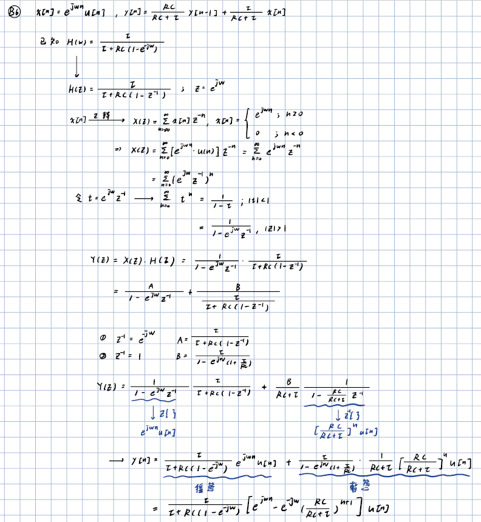
---
### B6：LaTex
輸入訊號為
$$
x[n]=e^{j\omega n}u[n]
$$

且離散時間 RC 濾波器為

$$
y[n]=\frac{RC}{RC+\tau}y[n-1]+\frac{\tau}{RC+\tau}x[n].
$$

由 B5 已知頻率響應為

$$
H(\omega)=\frac{\tau}{\tau+RC(1-e^{-j\omega})}.
$$

對應的系統轉移函數為

$$
H(z)=\frac{\tau}{\tau+RC(1-z^{-1})},\qquad z=e^{j\omega}.
$$

---

#### 1. 求輸入訊號的 Z Transform

由

$$
x[n]=e^{j\omega n}u[n]
$$

可得

$$
X(z)=\sum_{n=0}^{\infty}x[n]z^{-n}=\sum_{n=0}^{\infty}e^{j\omega n}z^{-n}=\sum_{n=0}^{\infty}(e^{j\omega}z^{-1})^n.
$$

利用等比級數

$$
\sum_{n=0}^{\infty}t^n=\frac{1}{1-t},\qquad |t|<1,
$$

令

$$
t=e^{j\omega}z^{-1},
$$

因此

$$
\boxed{
X(z)=\frac{1}{1-e^{j\omega}z^{-1}},\qquad |z|>1
}
$$

---

#### 2. 求輸出訊號 $Y(z)$

由

$$
Y(z)=X(z)H(z),
$$

可得

$$
Y(z)=\frac{1}{1-e^{j\omega}z^{-1}}\cdot\frac{\tau}{\tau+RC(1-z^{-1})}.
$$

使用部分分式展開：

$$
Y(z)=\frac{A}{1-e^{j\omega}z^{-1}}+\frac{B}{\tau+RC(1-z^{-1})}.
$$

---

#### 3. 求係數 $A$

令

$$
z^{-1}=e^{-j\omega},
$$

可得

$$
\boxed{
A=\frac{\tau}{\tau+RC(1-e^{-j\omega})}
}
$$

因此

$$
A=H(\omega).
$$

---

#### 4. 求係數 $B$

令

$$
\tau+RC(1-z^{-1})=0,
$$

可得

$$
z^{-1}=1+\frac{\tau}{RC}.
$$

因此

$$
\boxed{
B=\frac{\tau}{1-e^{j\omega}\left(1+\frac{\tau}{RC}\right)}
}
$$

所以

$$
Y(z)=\frac{\tau}{\tau+RC(1-e^{-j\omega})}\frac{1}{1-e^{j\omega}z^{-1}}+\frac{B}{\tau+RC(1-z^{-1})}.
$$

---

#### 5. Inverse Z Transform

第一項為

$$
\mathcal{Z}^{-1}\left\{\frac{1}{1-e^{j\omega}z^{-1}}\right\}=e^{j\omega n}u[n].
$$

第二項先整理為

$$
\frac{1}{\tau+RC(1-z^{-1})}=\frac{1}{RC+\tau}\frac{1}{1-\frac{RC}{RC+\tau}z^{-1}}.
$$

因此

$$
\mathcal{Z}^{-1}\left\{\frac{1}{\tau+RC(1-z^{-1})}\right\}=\frac{1}{RC+\tau}\left(\frac{RC}{RC+\tau}\right)^nu[n].
$$

所以輸出訊號為

$$
y[n]=\frac{\tau}{\tau+RC(1-e^{-j\omega})}e^{j\omega n}u[n]+\frac{\tau}{1-e^{j\omega}\left(1+\frac{\tau}{RC}\right)}\frac{1}{RC+\tau}\left(\frac{RC}{RC+\tau}\right)^nu[n].
$$

整理後可得

$$
\boxed{
y[n]=\frac{\tau}{\tau+RC(1-e^{-j\omega})}\left[e^{j\omega n}-e^{-j\omega}\left(\frac{RC}{RC+\tau}\right)^{n+1}\right]u[n]
}
$$

---

#### 穩態響應（Steady-State Response）

$$
\boxed{
y_{ss}[n]=\frac{\tau}{\tau+RC(1-e^{-j\omega})}e^{j\omega n}u[n]
}
$$

此項即為 B5 所求得的離散時間穩態響應。

#### 暫態響應（Transient Response）

$$
\boxed{
y_{tr}[n]=-\frac{\tau}{\tau+RC(1-e^{-j\omega})}e^{-j\omega}\left(\frac{RC}{RC+\tau}\right)^{n+1}u[n]
}
$$

由於

$$
0<\frac{RC}{RC+\tau}<1,
$$

因此當

$$
n\rightarrow\infty
$$

時，

$$
\left(\frac{RC}{RC+\tau}\right)^{n+1}\rightarrow0,
$$

所以暫態響應會逐漸消失，最後只剩下穩態響應。

---

#### 與 B4 連續時間結果比較

B4 的連續時間暫態項為

$$
e^{-t/(RC)},
$$

而 B6 的離散時間暫態項主要為

$$
\left(\frac{RC}{RC+\tau}\right)^n=\left(1+\frac{\tau}{RC}\right)^{-n}.
$$

由於

$$
t=n\tau,
$$

當取樣率增加，也就是 $\tau\rightarrow0$ 時，

$$
\boxed{
\left(\frac{RC}{RC+\tau}\right)^n\rightarrow e^{-t/(RC)}
}
$$

因此取樣率越高，離散時間的暫態響應會越接近 B4 的連續時間暫態響應。


### B7:C 程式模擬與結果討論

#### 程式說明
本題主要分成三個部分：

1. `sine_wav_gen.c`：產生各種頻率與取樣率的雙聲道輸入訊號。
2. `RC_filtering.c`：將輸入 WAV 依照一階 RC 低通濾波器進行離散時間濾波。
3. `plot_waveforms.py`：讀取濾波前後 WAV 檔，將時域波形繪製成比較圖。

---

## 1. 產生輸入訊號：`sine_wav_gen.c`

此程式接收命令列參數：

```bash
sine_wav_gen.exe fs f L out_fn
```

其中：
- `fs`：取樣率（例如 4000、8000、16000 Hz）；
- `f`：輸入正弦波頻率（例如 100、400、3000 Hz）；
- `L`：訊號長度（秒）；
- `out_fn`：輸出 WAV 檔名。

依據公式

$$
x[n] = A\sin(2\pi f t_n),\qquad
y[n] = A\cos(2\pi f t_n)
$$

生成 stereo PCM 音訊，其中左聲道為 sine，右聲道為 cosine。

建立標準 WAV 檔頭:
- `RIFF` / `WAVE` 標頭。
- `fmt ` （取樣率、聲道數、位元深度）。
- `data` （PCM 音訊資料）。

最後輸出檔名為 `sincos_fs{fs}_f{f}_L{L}.wav` 的雙聲道 WAV 檔。

---

## 2. RC 低通濾波：`RC_filtering.c`

該程式的輸入為一個既有的 WAV 檔，輸出為濾波後的 WAV 檔：

```bash
RC_filtering.exe input.wav output.wav
```

程式會讀取 WAV 檔的檔頭，確認：
- 檔案格式為 `RIFF/WAVE`；
- `audioFormat = 1`（PCM）；
- `numChannels = 2`；
- `bitsPerSample = 16`；
- 資料量能被 `short` 整除。 

接著，將資料讀入記憶體後，對每個聲道逐樣本執行一階 RC 低通濾波。

離散時間的 RC 低通濾波器使用差分近似，可表示為

$$
Y[n] = aY[n-1] + bX[n]
$$

其中

$$
\tau = \frac{1}{f_s},\qquad
RC = 1000\cdot\frac{1}{2\pi\cdot 400\cdot 1000},\qquad
a = \frac{RC}{RC + \tau},\qquad
b = \frac{\tau}{RC + \tau}.
$$

這個離散式迭代公式等價於一階低通濾波器的數值模擬，也就是利用前一個輸出值與目前輸入值進行加權平均，讓高頻成分被衰減、低頻成分保留下來。

在程式中，`previousY[channel]` 會保存上一點的輸出值，並在每個 sample 更新一次。這樣能在不改變音訊格式的情況下，對每個聲道做濾波，最後寫回新的 WAV 檔。

---

## 3. 波形繪圖：`plot_waveforms.py`

`plot_waveforms.py` 會讀取原始訊號與濾波後訊號的 WAV 檔，並將前後波形繪製成對照圖。它的流程如下：

- 讀取 `sincos_fs{fs}_f{f}_L1.0.wav`；
- 讀取 `filtered_sincos_fs{fs}_f{f}_L1.0.wav`；
- 檢查兩者的取樣率與聲道數是否一致；
- 以程式所在資料夾作為 WAV 檔與輸出圖檔的基準路徑；
- 根據取樣後的可見頻率，取前 5 個週期繪製兩條時域曲線；
- 將結果存成 `figure/waveform_fs{fs}_f{f}.png`。

若輸入頻率高於 Nyquist 頻率，圖中會以取樣後的混疊頻率顯示波形。例如 $f_s=4000$ Hz、$f=3000$ Hz 時，取樣波形呈現為 1000 Hz，因此繪圖區間取該頻率的 5 個週期。

圖中有兩個圖，分別顯示：
- Left channel: sine；
- Right channel: cosine。

每個圖都會同時繪製「濾波前」與「濾波後」兩條波形，便於觀察 RC 低通濾波器在低頻與高頻下的衰減效果。

---

## 理論與模擬比較

離散系統的穩態頻率響應為

$$
H_d(\omega)=\frac{b}{1-ae^{-j\omega}},\qquad \omega=\frac{2\pi f}{f_s}.
$$
 
$f_s=4000$ Hz

| 頻率 $f$ | B3 振幅 | B5 振幅 | B3 相位 | B5 相位 |
|---:|---:|---:|---:|---:|
| 100 Hz | 0.9701 | 0.9528 | $-14.04^\circ$ | $-13.72^\circ$ |
| 400 Hz | 0.7071 | 0.6231 | $-45.00^\circ$ | $-35.66^\circ$ |
| 3000 Hz | 0.1322 | 0.3288* | $-82.41^\circ$ | $+31.56^\circ$* |

$f_s=8000$ Hz

| 頻率 $f$ | B3 振幅 | B5 振幅 | B3 相位 | B5 相位 |
|---:|---:|---:|---:|---:|
| 100 Hz | 0.9701 | 0.9613 | $-14.04^\circ$ | $-13.89^\circ$ |
| 400 Hz | 0.7071 | 0.6589 | $-45.00^\circ$ | $-40.40^\circ$ |
| 3000 Hz | 0.1322 | 0.1467 | $-82.41^\circ$ | $-19.28^\circ$ |

$f_s=16000$ Hz

| 頻率 $f$ | B3 振幅 | B5 振幅 | B3 相位 | B5 相位 |
|---:|---:|---:|---:|---:|
| 100 Hz | 0.9701 | 0.9657 | $-14.04^\circ$ | $-13.97^\circ$ |
| 400 Hz | 0.7071 | 0.6812 | $-45.00^\circ$ | $-42.72^\circ$ |
| 3000 Hz | 0.1322 | 0.1303 | $-82.41^\circ$ | $-50.03^\circ$ |

`*`：當 $f_s=4000$ Hz 時，Nyquist frequency 為 $2000$ Hz，而輸入頻率為 $3000$ Hz，因此發生 aliasing。

連續時間的振幅與相位參考值（B3）分別是：

100 Hz 為 $0.9701$、$-14.04^\circ$；400 Hz 為 $0.7071$、$-45.00^\circ$；3000 Hz 為 $0.1322$、$-82.41^\circ$。

在 100 Hz，離散結果已接近連續時間結果；提高取樣率時，100 Hz 與 400 Hz 的離散振幅也逐漸接近類比值。3000 Hz 的相位差仍明顯，顯示取樣率與離散化方式都會影響高頻結果。

RC 低通的截止頻率是 400 Hz。在此頻率，類比振幅比為


$$
|H(2\pi f_c)|=\frac{1}{\sqrt{2}}\approx0.7071,
\qquad 20\log_{10}(0.7071)\approx-3.01\ \mathrm{dB}.
$$

這就是 $-3\ \mathrm{dB}$ 截止點：振幅降為約 $0.707$，功率約為原來的一半。100 Hz 低於截止頻率，衰減較小；3000 Hz 高於截止頻率，衰減較大。

當 $f_s=4000$ Hz 時，Nyquist 頻率為 $2000$ Hz，3000 Hz 高於 Nyquist 頻率。取樣後它會混疊成 $-1000$ Hz（以實數波形觀察時頻率為 1000 Hz），所以這組不能當成原本連續時間 3000 Hz 訊號的取樣。其他取樣率的 Nyquist 頻率分別是 4000 Hz 與 8000 Hz，3000 Hz 訊號不會發生此種混疊。

### 濾波結果波形比較圖
$f_s=4000$ Hz $f=100$ Hz
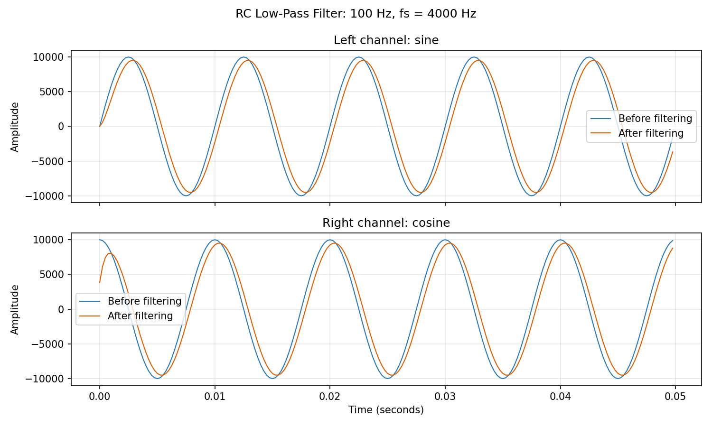

$f_s=4000$ Hz $f=400$ Hz
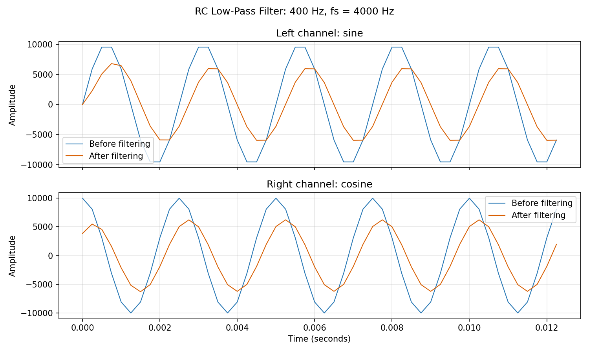

$f_s=4000$ Hz $f=3000$ Hz
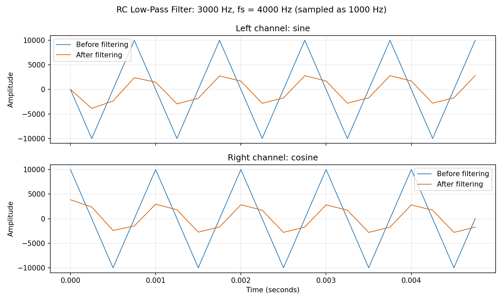

$f_s=8000$ Hz $f=100$ Hz


$f_s=8000$ Hz $f=400$ Hz


$f_s=8000$ Hz $f=3000$ Hz
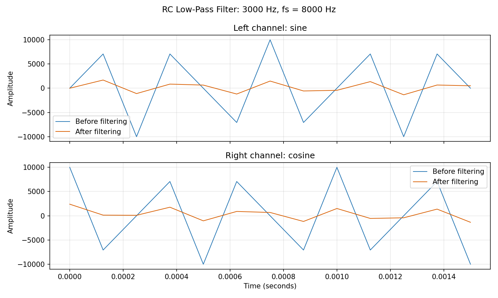

$f_s=16000$ Hz $f=100$ Hz
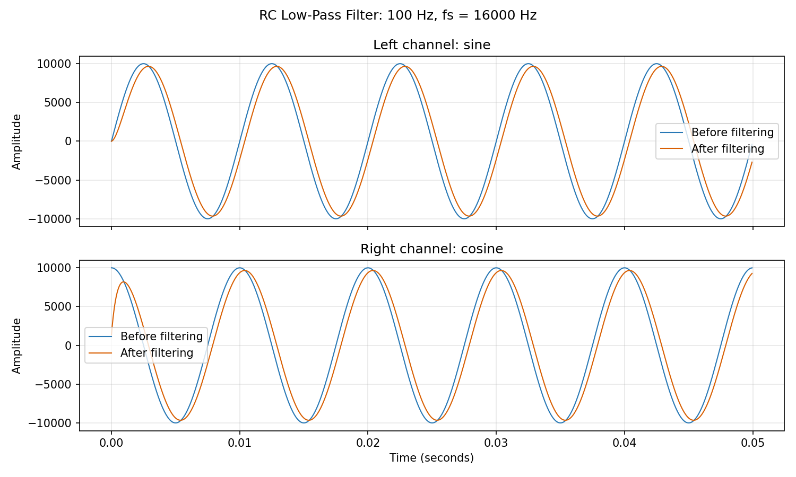

$f_s=16000$ Hz $f=400$ Hz
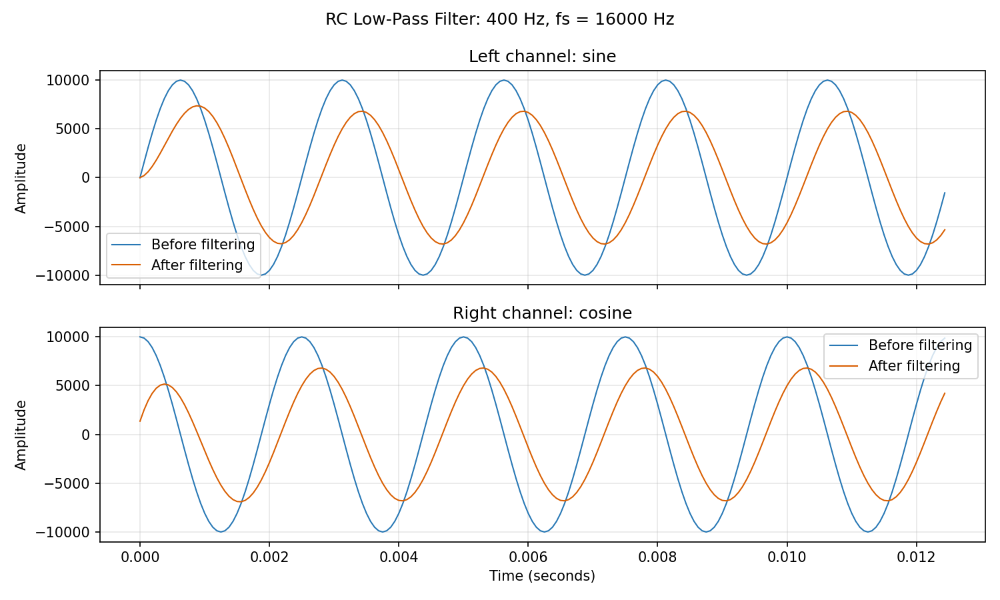

$f_s=16000$ Hz $f=3000$ Hz
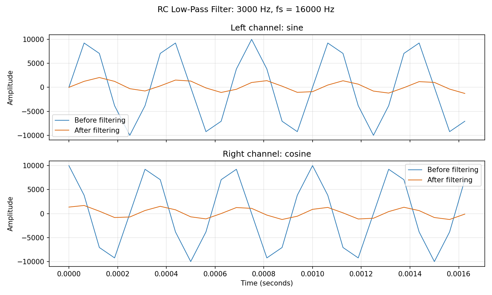

### 濾波結果比較

由 B3 與 B5 的結果可知，離散時間 RC 濾波器的輸出會隨取樣率提高而逐漸接近 Analog RC 濾波器。

| 頻率 $f$ | Analog 振幅 | $f_s=4000$ | $f_s=8000$ | $f_s=16000$ |
|---:|---:|---:|---:|---:|
| 100 Hz | 0.9701 | 0.9528 | 0.9613 | 0.9657 |
| 400 Hz | 0.7071 | 0.6231 | 0.6589 | 0.6812 |
| 3000 Hz | 0.1322 | 0.3288* | 0.1467 | 0.1303 |

其中 $f_s=4000$ Hz 時，3000 Hz 超過 Nyquist frequency，因此發生 aliasing。

在低頻 100 Hz 時，離散結果與 Analog 已相當接近；在截止頻率 400 Hz 時，取樣率越高，振幅越接近理論值 $1/\sqrt{2}\approx0.7071$；在 3000 Hz 時，較高取樣率可得到較接近 Analog 的濾波結果。

---

### Analog vs Discrete 差異總結

Analog RC 濾波器的頻率響應為

$$
H_c(j\Omega)=\frac{1}{1+j\Omega RC}.
$$

Discrete RC 濾波器的頻率響應為

$$
H_d(e^{j\omega})=\frac{\tau}{\tau+RC(1-e^{-j\omega})}.
$$

兩者的主要差異來自離散系統使用差分近似微分，因此取樣週期 $\tau$ 越小，離散結果越接近 Analog 結果。

$$
f_s\uparrow \Rightarrow \tau\downarrow \Rightarrow H_d(e^{j\omega})\rightarrow H_c(j\Omega)
$$

另外，Discrete 系統受到 Nyquist sampling theorem 限制，若輸入頻率高於 $f_s/2$，將發生 aliasing；Analog 系統則沒有此取樣限制。

當提高 sampling rate 可以降低離散化誤差，使振幅、相位與暫態響應更接近 Analog RC 低通濾波器。

## 檔案

- `sine_wav_gen.c`：產生輸入 sine/cosine 雙聲道 WAV。
- `RC_filtering.c`：使用式 (8) 進行 RC 低通濾波。
- `plot_waveforms.py`：讀取 WAV 並產生比較圖。
- `figure/`：手寫解答圖與 Problem 7 的 9 張濾波前後波形圖。
- `sincos_*.wav` 與 `filtered_sincos_*.wav`：9 組輸入音檔及對應的濾波結果。
