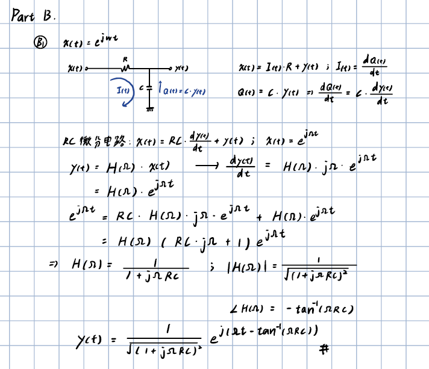
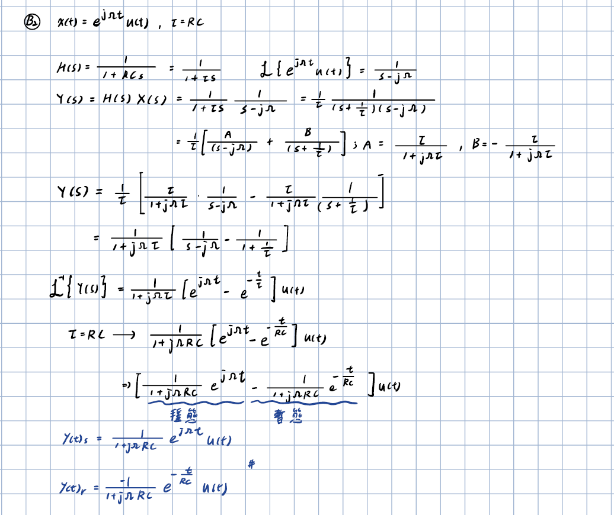
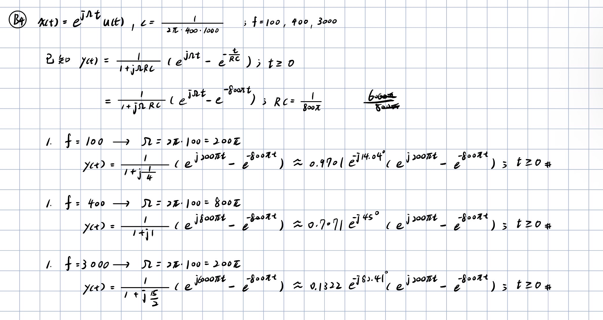
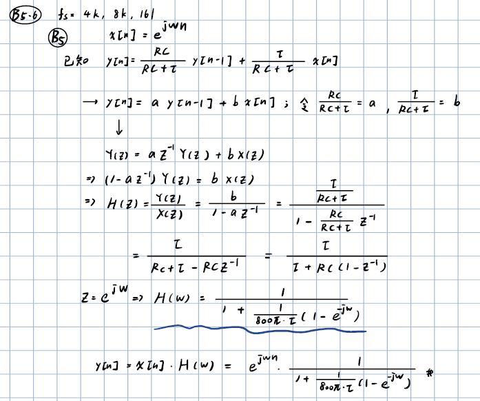
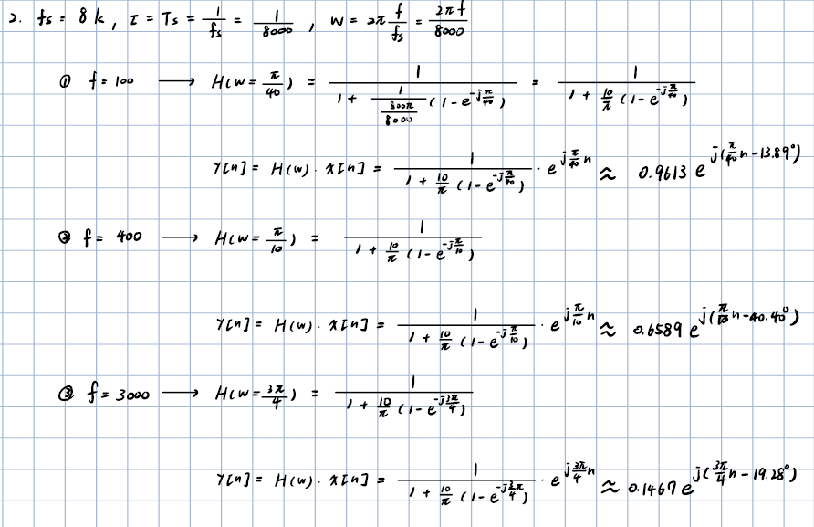
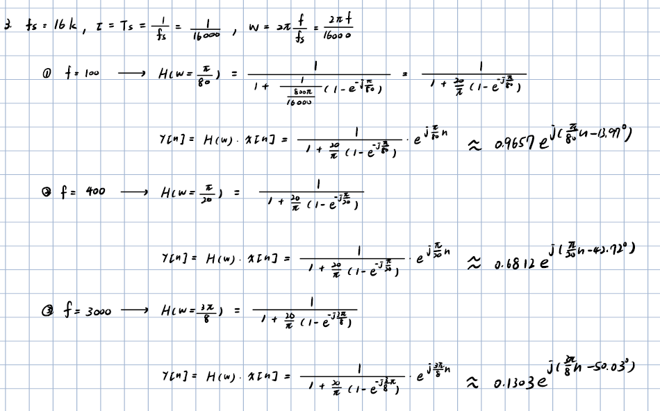
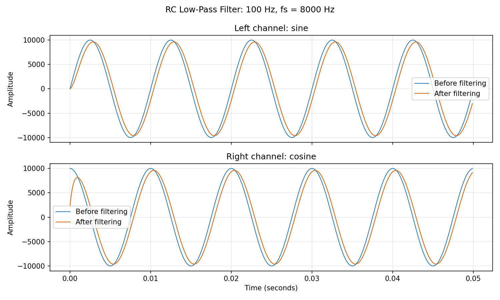
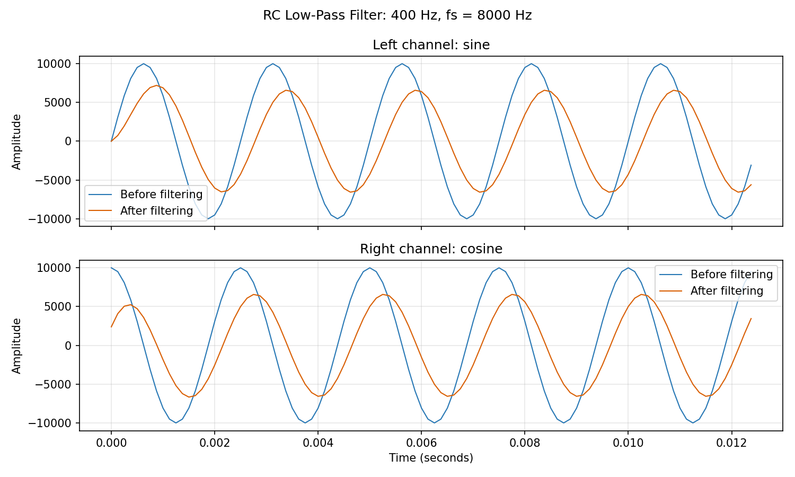

# DSP Assignment 1：RC Low-Pass Filter

本頁整理 RC 低通濾波器作業的主要結果、手寫解答圖片與模擬波形。數學式以簡潔文字呈現，避免原始 LaTeX 指令影響閱讀。

**課程作業：** 數位訊號處理　｜　**學號：** 711581103　｜　**姓名：** 吳祖慷

## 目錄

- [Part A：相量暖身題](#part-a相量暖身題)
- [Part B：RC 低通濾波器](#part-brc-低通濾波器)
- [Part C：音訊與波形模擬](#part-c音訊與波形模擬)
- [程式檔案](#程式檔案)

## Part A：相量暖身題

### A1、A2：訊號相加與相量分析

### A3：波形繪製

以下為作業中的波形繪圖結果：

## Part B：RC 低通濾波器

### 電路參數與頻率響應

| 參數 | 數值 |
| --- | --- |
| 電阻 R | 1,000 Ω |
| 電容 C | 1 / (2π × 400 × 1,000) F |
| 時間常數 RC | 1 / (800π) s |
| 截止頻率 fc | 400 Hz |

一階 RC 低通濾波器的頻率響應為 `H(jΩ) = 1 / (1 + jΩRC)`。

| 輸入頻率 | 增益 \|H\| | 相位 |
| ---: | ---: | ---: |
| 100 Hz | 0.9701 | −14.04° |
| 400 Hz | 0.7071 | −45.00° |
| 3,000 Hz | 0.1322 | −82.41° |

### B1–B4：連續時間分析

電路微分方程為 `RC · dy(t)/dt + y(t) = x(t)`。對輸入 `x(t) = e^(jΩt)u(t)`，輸出包含穩態項與會隨時間衰減的暫態項；暫態衰減由時間常數 RC 決定。

### B5：離散時間濾波器

使用取樣週期 `τ = 1/fs`，差分方程可寫為：

`y[n] = a·y[n−1] + b·x[n]`

其中 `a = RC / (RC + τ)`，`b = τ / (RC + τ)`。

## Part C：音訊與波形模擬

程式以 4 kHz、8 kHz、16 kHz 三種取樣率，以及 100 Hz、400 Hz、3,000 Hz 三種輸入頻率產生訊號並進行濾波。當輸入頻率超過取樣率的一半時，離散訊號會受到 Nyquist 頻率與混疊影響。

下方列出 8 kHz 取樣率下的波形比較：

**100 Hz**

**400 Hz**

**3,000 Hz**

其他取樣率與輸入頻率的圖表可在 [`figure/`](figure/) 資料夾查看。

## 程式檔案

- [`RC_filtering.c`](RC_filtering.c)：對 WAV 音訊執行 RC 低通濾波。
- [`sine_wav_gen.c`](sine_wav_gen.c)：產生正弦與餘弦雙聲道 WAV 訊號。
- [`plot_waveforms.py`](plot_waveforms.py)：繪製濾波前後的波形比較圖。
